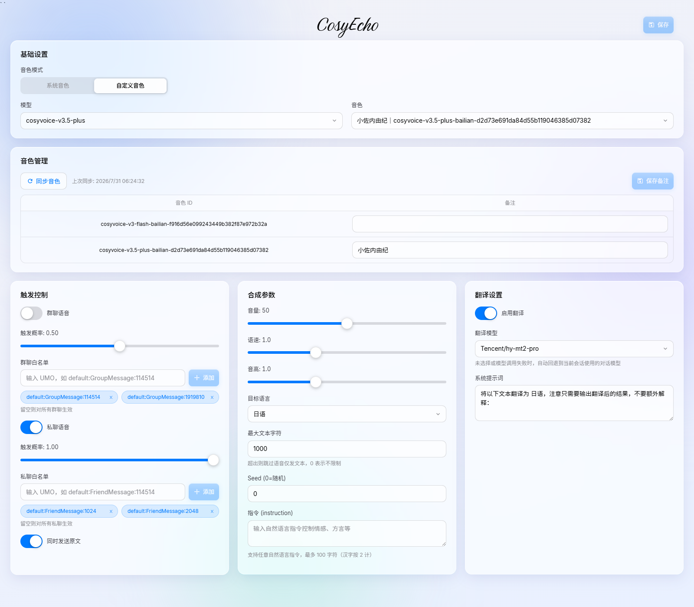
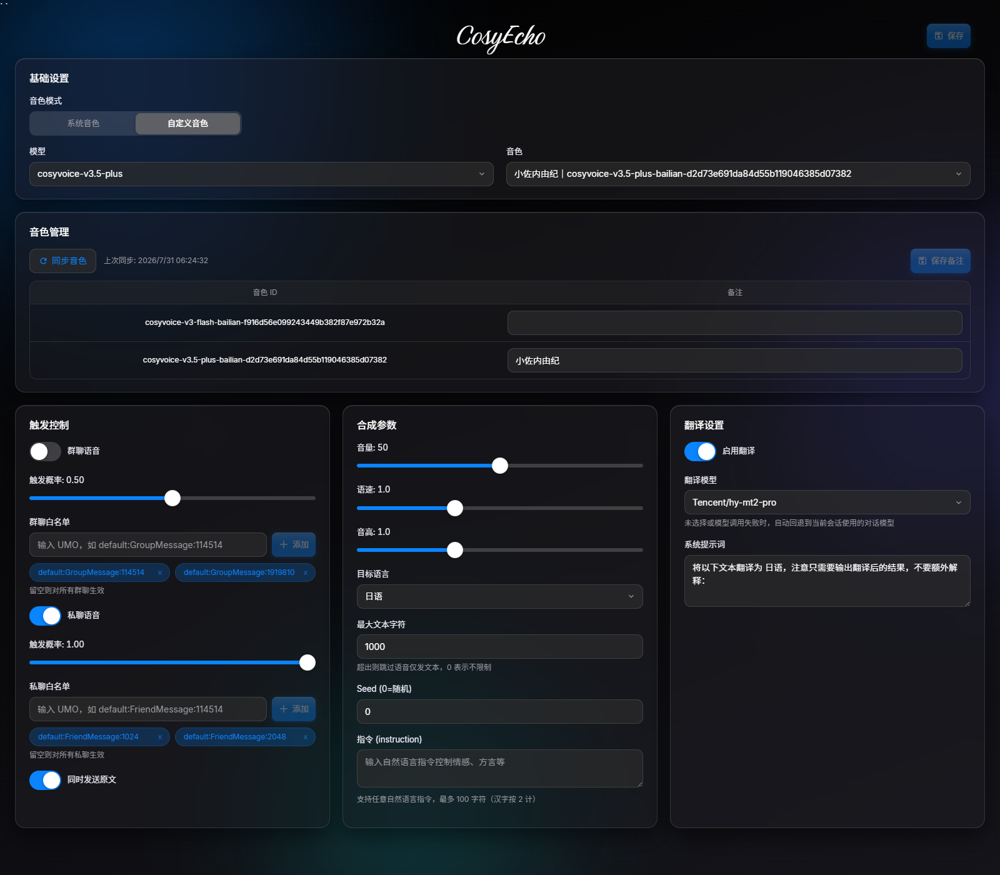

<h1 align="center">CosyEcho</h1>

<p align="center">
  
</p>

<p align="center">
  
  
  
</p>

基于阿里云百炼 CosyVoice 的 AstrBot 语音合成插件。LLM 回复自动转为语音发送，支持系统音色、自定义音色两种模式，内置 WebUI 配置面板。

<p align="center">
  
</p>

## 功能简介

CosyEcho 在 LLM 生成回复后自动将文本合成为语音消息发送，让对话"听得见"。支持系统预置音色与自定义音色（复刻/设计）两种模式，内置 WebUI 可视化配置面板，无需手写配置文件。

## 内容列表

- [功能简介](#功能简介)
- [功能特性](#功能特性)
- [界面预览](#界面预览)
- [快速开始](#快速开始)
- [使用示例](#使用示例)
- [配置项说明](#配置项说明)
- [常见问题](#常见问题)
- [维护者](#维护者)
- [如何贡献](#如何贡献)
- [许可证](#许可证)

## 功能特性

- **自动朗读**：LLM 回复自动转为语音播放，聊完即可听
- **音色丰富**：内置多种系统音色，也可克隆或设计自定义音色
- **模型多样**：支持 CosyVoice v3.5 / v3 系列开源模型
- **音色管理**：WebUI 可视化管理音色，可同步、备注、删除
- **指令控制**：用自然语言指令控制语气、情感、方言、语速等合成效果
- **翻译合成**：可选先翻译再合成语音，自定义翻译模型与目标语言
- **分别控制**：群聊和私聊可独立设置开关、白名单与触发概率

## 界面预览

自定义音色模式下的 WebUI 配置面板（浅色 / 深色主题）：

| 浅色主题 | 深色主题 |
|----------|----------|
|  |  |

## 快速开始

### 安装

#### 方法一：通过插件市场安装（推荐）

1. 打开 AstrBot WebUI → 插件管理 → 插件市场。
2. 添加插件源（如尚未添加）：
   - 源名称：`AstrBot Official Plugin Market`
   - 源地址：`https://cloud-test.astrbot.app/api/v1/market/plugins.json`
3. 在插件市场中搜索 **CosyEcho**（`astrbot_plugin_cosyecho`），点击安装。
4. 等待安装完成，确认插件已启用。

#### 方法二：从 GitHub 安装

1. 打开 AstrBot WebUI → 插件管理 → 新增插件。
2. 选择 **从 GitHub 安装**。
3. 填入仓库地址：
   ```
   https://github.com/NoFizz/astrbot_plugin_cosyecho
   ```
4. 等待安装完成，确认插件已启用。

#### 方法三：手动安装

1. 将本仓库克隆或下载到 AstrBot 的插件目录：
   ```bash
   cd AstrBot/data/plugins
   git clone https://github.com/NoFizz/astrbot_plugin_cosyecho.git
   ```
2. 安装依赖：
   ```bash
   pip install -r astrbot_plugin_cosyecho/requirements.txt
   ```
3. 在 AstrBot WebUI 中重载插件，或重启 AstrBot。

### 安装后检查

- 确认 `requirements.txt` 中的依赖已正确安装。
- 在 WebUI 插件管理中确认插件状态为"已启用"且无报错。
- 在插件配置中填入阿里云百炼 API Key。
- 进入插件 WebUI 页面（点击插件卡片 → 打开 Pages → settings）完成设置。

## 使用示例

本插件无用户命令，采用事件驱动方式自动工作。

**触发方式**：当 LLM 生成回复后，插件自动拦截回复文本（`on_llm_response` 钩子），将其合成为语音消息发送。

**使用流程**：

1. 在插件配置中填入百炼 API Key
2. 进入 WebUI 页面选择模式、模型、音色，点击保存
3. 正常与 LLM 对话，回复会自动转为语音发送

## 配置项说明

本插件采用双层配置体系：

- **AstrBot 原生配置**（`_conf_schema.json`）：仅 API Key，在插件管理面板中填写。
- **WebUI 设置**（`settings.json`）：所有其他参数，在插件 Pages 页面中配置。

### AstrBot 原生配置

| 配置项 | 类型 | 默认值 | 说明 |
|--------|------|--------|------|
| `api_key` | string | 空 | 阿里云百炼 API Key，在百炼控制台获取 |

### WebUI 设置

所有配置均在 WebUI 页面中完成（插件卡片 → Pages → settings）。

#### 基础设置

| 配置项 | 类型 | 默认值 | 说明 |
|--------|------|--------|------|
| 音色模式 `mode` | enum | `system` | `system` 系统音色 / `custom` 自定义音色（复刻/设计） |
| 模型 `model` | enum | `cosyvoice-v3-flash` | 根据模式自动筛选可用模型 |
| 音色 `voice` | string | `longanyang` | 根据模型+模式自动筛选音色池 |
| 采样格式 `format` | enum | `wav` | 输出音频格式 |
| 采样率 `sample_rate` | number | `24000` | 输出音频采样率 |

#### 合成参数

| 配置项 | 类型 | 默认值 | 说明 |
|--------|------|--------|------|
| 音量 `volume` | number | `50` | 范围 0–100 |
| 语速 `rate` | number | `1.0` | 范围 0.5–2.0 |
| 音高 `pitch` | number | `1.0` | 范围 0.5–2.0 |
| 目标语言 `language_hint` | enum | `zh` | 中/英/日/韩/法/德/俄/葡/泰/印尼/越 |
| 指令 `instruction` | string | 空 | 控制语气/情感/方言/语速等；根据模型和音色类型动态启用/禁用 |
| 随机种子 `seed` | number | `0` | 0 表示随机 |
| Markdown 过滤 `enable_markdown_filter` | bool | `false` | 合成前过滤 Markdown 标记 |
| 文本上限 `max_text_chars` | number | `1000` | TTS 文本最大字符数，0 表示不限制；超限时跳过语音仅发送原文 |

#### 触发控制

| 配置项 | 类型 | 默认值 | 说明 |
|--------|------|--------|------|
| 群聊开关 `group_voice_enabled` | bool | `true` | 群聊是否触发语音 |
| 群聊白名单 `group_whitelist` | list | 空 | UMO 格式；留空表示全部允许 |
| 群聊触发概率 `group_trigger_probability` | number | `0.2` | 0–1，1 表示总是触发 |
| 私聊开关 `private_voice_enabled` | bool | `true` | 私聊是否触发语音 |
| 私聊白名单 `private_whitelist` | list | 空 | UMO 格式；留空表示全部允许 |
| 私聊触发概率 `private_trigger_probability` | number | `0.2` | 0–1，1 表示总是触发 |
| 同时发送原文 `send_text_with_voice` | bool | `false` | 语音消息是否附带原文文本 |
| 请求超时 `timeout` | number | `20` | 下载音频的请求超时秒数 |

#### 翻译设置

| 配置项 | 类型 | 默认值 | 说明 |
|--------|------|--------|------|
| 翻译开关 `translation_enabled` | bool | `false` | 合成前是否先翻译文本 |
| 翻译模型 `translation_model` | string | 空 | 留空时自动回退到当前会话的对话模型 |
| 系统提示词 `system_prompt` | string | 默认模板 | 含 `{target_lang}` 占位符，翻译时替换为目标语言中文名 |

#### 翻译模型回退链

当翻译开关开启且系统提示词非空时，翻译按以下顺序回退：

1. **使用配置的 `translation_model`**——命中：直接调用该模型翻译；跳过：配置为空。
2. **回退到当前会话对话模型**——当配置为空或配置模型调用失败时，自动改用当前会话的对话模型。
3. **最终降级**——若会话模型也不可用或全部失败，跳过翻译，发送原文。

### 支持的模型

| 模型 | 系统音色 | 复刻/设计音色 | 指令(自定义音色) | 指令(系统音色) |
|------|---------|-------------|---------------|-------------|
| cosyvoice-v3.5-plus | 不支持 | 支持 | 任意自然语言 | - |
| cosyvoice-v3.5-flash | 不支持 | 支持 | 任意自然语言 | - |
| cosyvoice-v3-plus | 支持 | 支持 | 不支持 | 固定格式 |
| cosyvoice-v3-flash | 支持 | 支持 | 任意自然语言 | 固定格式 |

## 常见问题

**Q1：需要什么环境？**
Python >= 3.10、dashscope >= 1.14.0、httpx >= 0.24.0、pyyaml >= 6.0。

**Q2：数据存在哪里？隐私如何？**
- 设置文件：`data/plugin_data/astrbot_plugin_cosyecho/settings.json`
- 音色数据：`data/plugin_data/astrbot_plugin_cosyecho/voices_data.json`
- 外部 API：语音合成调用阿里云百炼 API，合成文本会发送至百炼服务
- 临时音频：合成产生的临时音频文件在消息发送后自动清理

**Q3：工作原理是什么？**
通过拦截 LLM 回复（`on_llm_response`），将文本合成为语音后替换原消息发送。

**Q4：和其他插件会冲突吗？**
如果其他插件在 `on_decorating_result` 阶段重写了消息链，可能会覆盖语音消息。

**Q5：文本太长怎么办？**
合成文本默认最大 1000 字符（可在 WebUI 自定义，0 表示不限制）；超出上限时跳过语音、仅发送原文（不受"同时发送原文"开关影响）。

**Q6：指令有什么限制？**
instruction 最大 100 字符（汉字按 2 计），超出自动截断。

**Q7：自定义音色为什么不能跨模型使用？**
复刻/设计音色创建时绑定模型，不能跨模型使用。

## 维护者

**NoFizz** · [GitHub](https://github.com/NoFizz)

## 如何贡献

欢迎提交 [Issue](https://github.com/NoFizz/astrbot_plugin_cosyecho/issues) 反馈问题或功能建议，也接受 [Pull Request](https://github.com/NoFizz/astrbot_plugin_cosyecho/pulls)。

## 许可证

本项目基于 [AGPL-3.0](LICENSE) 许可证开源。